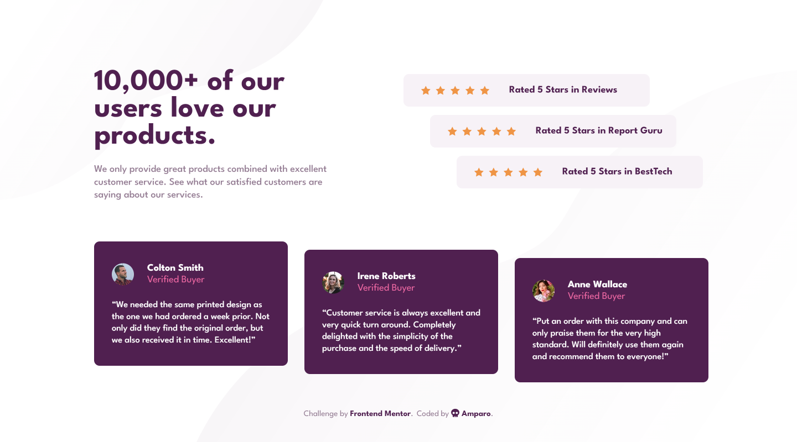
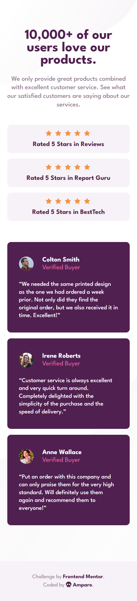
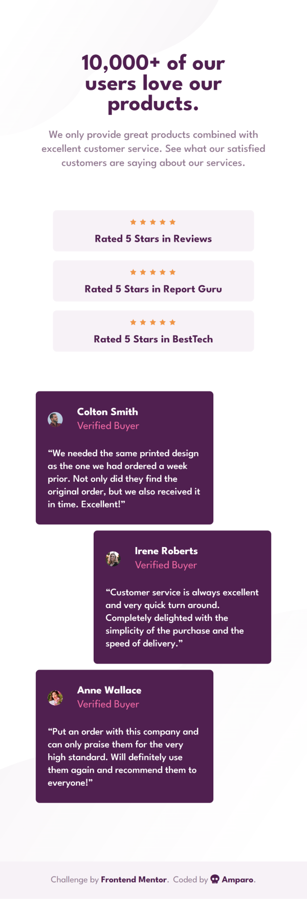

# Frontend Mentor - Product preview card component solution

This is a solution to the [social proof section challenge on Frontend Mentor](https://www.frontendmentor.io/challenges/social-proof-section-6e0qTv_bA).

## Table of contents

- [Overview](#overview)
  - [The challenge](#the-challenge)
  - [Screenshots](#screenshots)
  - [Links](#links)
- [My process](#my-process)
  - [Built with](#built-with)
- [Author](#author)

## Overview

### The challenge

Users should be able to:

- View the optimal layout for the section depending on their device's screen size

### Screenshots

#### Desktop

#### Mobile

#### Tablet

### Links

- [Solution](https://www.frontendmentor.io/solutions/)
- [Live site](https://amparoamparo.github.io/frontendmentor-social-proof-section/)

## My process

The challenge was meant for mobile and desktop only, but I also made it responsive, at least for it to not look awful on screens larger than 375px wide.

Some of the text might look different from the original design, since I fixed a few typos here and there.

My CSS is currently a bit disorganised, will tidy it up one of these days. (Narrator: 'She did not, in fact, tidy her CSS up.')

### Built with

- Figma: used to measure things like padding, border radii, margins, etc. I do not have a Pro account, thus no Figma source file. I just measured from the provided design screenshots.
- Semantic HTML5 markup
- CSS custom properties
- Flexbox
- CSS Grid
- Sass (First time using Sass! 😳)

## Author

- Amparo 💀 - [Say hello 😀](mailto:hello@amparo.ooo?subject=Hello+from+GitHub)
- Frontend Mentor - [@amparoamparo](https://www.frontendmentor.io/profile/amparoamparo)
- freeCodeCamp - [@amparo](https://freecodecamp.org/amparo)
- GitHub - [@amparoamparo](https://www.github.com/amparoamparo)
